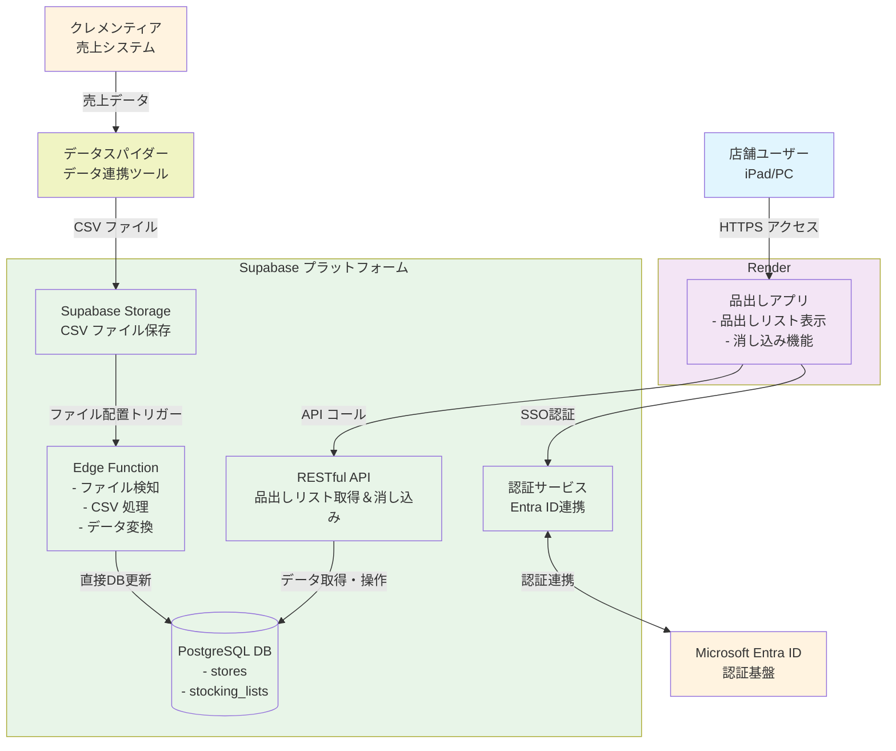

# 品出しリストアプリ 要件定義書

## 1. システム概要

### 1.1 システム名
品出しリストアプリ（Web版）

### 1.2 システム目的
店舗における品出し業務の効率化、正確性向上、顧客対応向上を目的とし、従来の商品タグを手でもぎ取る作業を廃止し、デジタル化された品出しリストによる管理を実現する。

### 1.3 システム形態
- **プラットフォーム**: Webアプリケーション
- **ホスティング**: Render
- **データベース**: Supabase
- **認証**: SSO（店舗アカウント: b店舗コード@stripe-intl.com）

## 2. 機能要件

### 2.1 認証・認可機能

#### 2.1.1 ログイン機能
- **認証方式**: SSO（シングルサインオン）
- **アカウント形式**: b店舗コード@stripe-intl.com
- **連携情報**: 所属店舗情報、権限情報

- **SSOプロバイダー**: Microsoft Entra ID

#### 2.1.2 権限管理
- 店舗単位でのデータアクセス制御
- アプリケーション利用権限はEntra IDでユーザーをアプリケーションに割り当てて管理
- 店舗内での権限区分なし（店長、副店長、一般スタッフの区別なし）

### 2.2 品出しリスト表示機能

#### 2.2.1 リスト表示
- ログイン店舗の品出しリストを表示
- 自動更新（データ連携は最速15分、画面更新は5分毎）

#### 2.2.2 表示項目
- **表示項目**: 商品名、品番、数量、売価、商品画像、JANコード
- **ソート・フィルター機能**: 不要

### 2.3 品出し消し込み機能

#### 2.3.1 消し込み方法
1. **バーコードスキャン**
   - iPadのカメラを使用したスキャン機能
   - スキャンした商品の自動消し込み
2. **スワイプ操作**
   - リスト項目をスワイプで消し込み
   - 左右スワイプでの簡単操作
3. **チェックボックス**
   - 複数選択後に一括消し込みボタンで処理

#### 2.3.2 誤操作防止・復元機能
- 確認ダイアログ表示: なし（操作の手間を省くため）
- 履歴画面からの復元機能: あり
- アンドゥ機能: なし

### 2.4 履歴管理機能

#### 2.4.1 消し込み履歴
- 消し込み日時、商品情報の記録
- 実施者の記録: なし（店舗単位でのログインのため個人特定不可）
- 履歴からの復元機能: あり
- **履歴保管期間**: 1年
- 履歴の検索・フィルター機能: 要検討
- 履歴のエクスポート機能: 要検討

## 3. 非機能要件

### 3.1 性能要件

#### 3.1.1 レスポンス時間
- 画面表示: 3秒以内
- 消し込み処理: 1秒以内

#### 3.1.2 同時接続数
- **想定店舗数**: 最大1000店舗
- **同時接続数**: 要検討（1店舗あたりの想定ユーザー数が必要）

### 3.2 可用性要件
- システム稼働率: 99.9%以上
- メンテナンス時間: 月1回、深夜時間帯

### 3.3 セキュリティ要件
- HTTPS通信の必須化
- セッション管理（タイムアウト設定）
- アクセスログの記録
- **IP制限**: なし（店舗iPadはVPN接続不可でIP固定不可のため）
- **多要素認証**: なし
- **デバイス認証**: なし

### 3.4 デバイス対応

#### 3.4.1 対応デバイス
- iPad（主要デバイス）
- iPhone
- Android タブレット・スマートフォン
- PC（デスクトップ・ノートPC）

#### 3.4.2 ブラウザ対応
- **対応ブラウザ**: Microsoft Edge のみ
  - iPad: Microsoft Edge
  - PC: Microsoft Edge
- **対応バージョン**: 最新バージョンを推奨

## 4. システム連携要件

### 4.1 クレメンティア連携

#### 4.1.1 データ取得
- **データ連携間隔**: 最短15分（それ以上の間隔もあり）
- **データ形式**: CSV形式
- 品出しリスト生成用データの取得

> **情報が不足**: 連携データ仕様の詳細が必要
> - 取得対象データの詳細項目（商品名、品番、数量、売価、JANコード等）
> - CSVファイルの配置場所・取得方法
> - ファイル名規則
> - 認証方式（FTP、SFTP、API等）
> - エラー時の処理方針

#### 4.1.2 データ処理
- 取得データから品出しリストの自動生成
- 重複データの排除
- エラーデータの処理

#### 4.1.3 データ取得方式
- **データ連携**: 最短15分間隔での自動取得
- **画面更新**: 5分毎の自動更新
- **手動更新**: ユーザーによる手動更新ボタンも提供（必要時）

> **検討が必要**: 手動更新機能の実装範囲
> - 更新ボタンの配置場所
> - 更新中の表示方法
> - 更新失敗時の処理
> - 更新頻度制限の要否（連続実行防止）

## 5. 技術仕様

### 5.1 アーキテクチャ

#### 5.1.1 システム構成図

#### 5.1.2 技術スタック
- **フロントエンド**: Next.js + TypeScript

- **ホスティング**: Render
- **データベース**: Supabase

### 5.2 データベース設計

#### 5.2.1 主要テーブル
> **情報が不足**: 詳細なテーブル設計が必要

**想定テーブル構成:**
- stores（店舗マスタ）
- stocking_lists（品出しリスト）

> **情報が不足**: 詳細なテーブル設計が必要
> - 商品マスタの管理方法（クレメンティアから取得 or 独自管理）
> - 消し込み履歴テーブルの要否と設計

### 5.3 外部連携

#### 5.3.1 バーコード読み取り
#### 5.3.1 バーコード読み取り機能
- **使用デバイス**: iPadのカメラ
- **対応ブラウザ**: Microsoft Edge
- **実装方式**: WebRTC Camera API + バーコード読み取りライブラリ

> **検討が必要**: バーコードライブラリの選定
> 1. **ZXing.js**
>    - 高い読み取り精度
>    - 豊富なフォーマット対応
> 2. **QuaggaJS**
>    - 軽量
>    - 1Dバーコード特化
> 3. **@zxing/library**
>    - TypeScriptサポート
>    - モダンなAPI設計

> **検討が必要**: カメラ機能の仕様
> - カメラ起動方法（ボタンクリック、自動起動等）
> - 読み取り成功時のフィードバック（音、振動、視覚的エフェクト）
> - 読み取り失敗時の処理
> - カメラ権限のリクエスト方法

## 6. 運用要件

### 6.1 データバックアップ
- **Supabase自動バックアップ**
  - 日次自動バックアップ
  - ポイントインタイムリカバリ (PITR) 対応
  - バックアップ保管期間: 30日

- **アプリケーションバックアップ**
  - Renderの自動バックアップ機能を利用
  - Gitリポジトリとの連携

### 6.2 監視・ログ
- アプリケーションログの記録
- エラーログの記録
- アクセスログの記録

> **情報が不足**: 監視要件の詳細が必要
> - 監視対象項目（レスポンス時間、エラー率等）
> - アラート通知方法
> - ログ保管期間

### 6.3 保守・運用体制
> **情報が不足**: 運用体制の詳細が必要
> - 障害対応体制（24時間365日 or 営業時間内等）
> - 保守作業の実施時間帯
> - サポート窓口の設置

## 7. 移行要件

### 7.1 移行方式
> **検討が必要**: 移行方式の選定
> 1. **一斉移行**
>    - 全店舗同時にシステム切り替え
>    - 短期間での移行完了
> 2. **段階移行**
>    - 店舗グループ毎の段階的移行
>    - リスク分散が可能
> 3. **並行運用期間**
>    - 従来方式との並行運用期間を設ける
>    - 安全だが運用負荷が高い

### 7.2 データ移行
> **情報が不足**: 既存データの有無と詳細が必要
> - 移行対象データの有無
> - データクレンジングの要否
> - 移行テストの方法

## 8. スケジュール

> **情報が不足**: プロジェクトスケジュールが必要
> - 要件確定予定日
> - 設計・開発期間
> - テスト期間
> - 本稼働予定日

## 9. 制約事項・前提条件

### 9.1 制約事項
- クレメンティアからのデータ取得は最短15分
- 画面更新は5分毎の自動更新
- 既存のSSO環境を利用
- Render + Supabaseでの構成

### 9.2 前提条件
- 売価変更をクレメンティアで漏れなく登録する運用
- %OFF商品のバーコード管理
- 店舗スタッフのデバイス操作習熟
- 安定したインターネット環境の提供

## 10. リスク・課題

### 10.1 技術的リスク
- Webブラウザでのバーコードスキャン精度
- iPadでの操作性（特にSafariの制限）
- 最大15分のデータラグによる運用への影響

### 10.2 運用リスク
- 店舗スタッフのITリテラシー
- ネットワーク障害時の業務継続性
- デバイスの故障・紛失対応

> **情報が不足**: リスク軽減策の詳細が必要
> - ネットワーク障害時の対応手順
> - システム障害時のエスカレーション体制
> - ユーザーサポート体制
